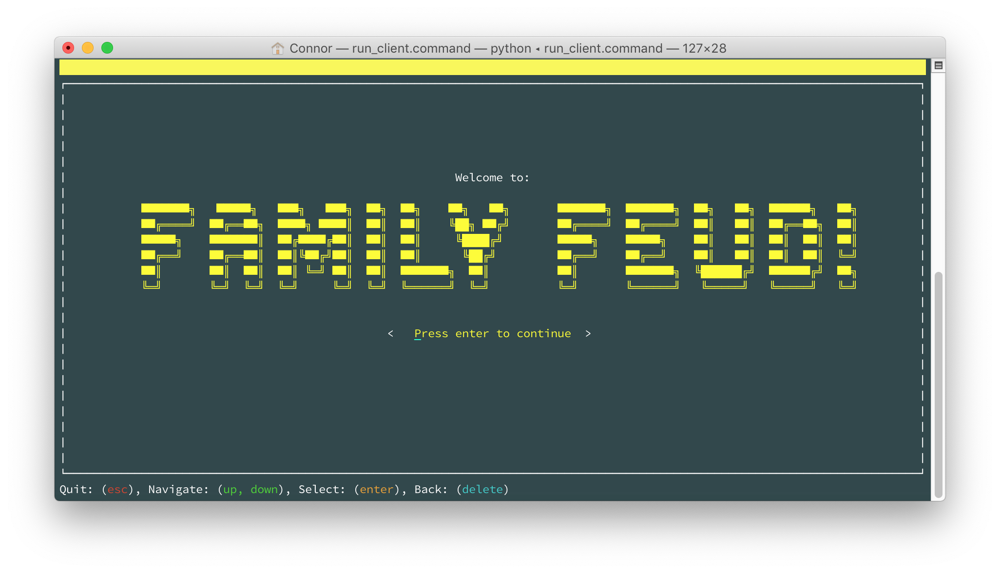
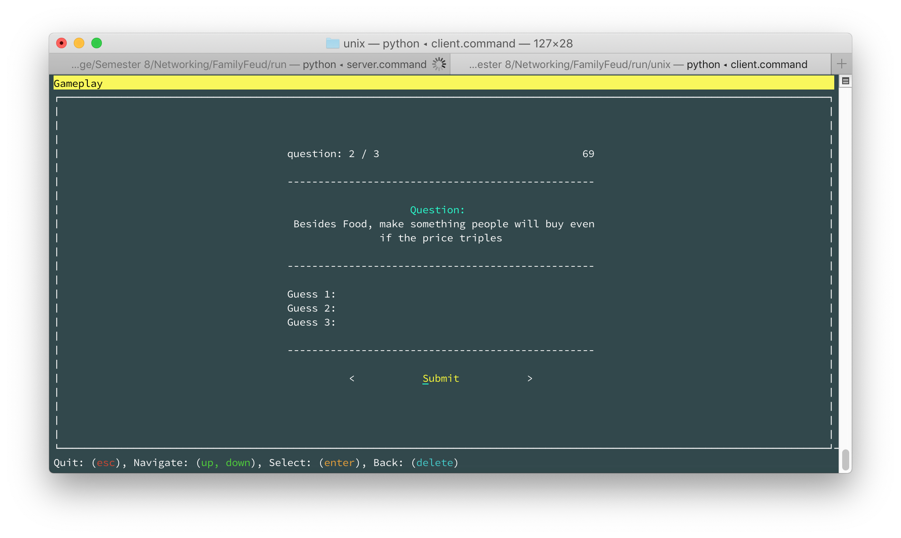
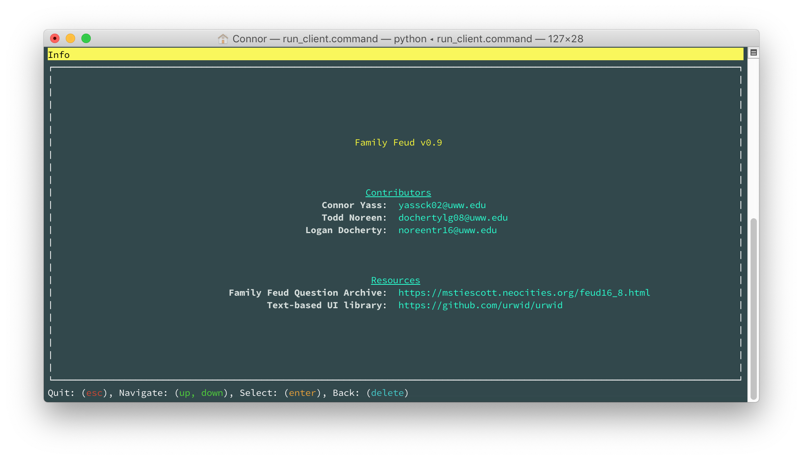

# Family Feud 🧠🏆💵
A text-based Family Feud game build on a client-server architecture

---

## Run
To start the server, run the script found at `/run/server.command`. To start the client, run the script found at `/run/client.command`. Because the .command files are bash scripts, windows users will have to run them with a tool like cygwin. All server code is found in the `/src/server.py` file and all client code is cound in the `/src/client/` folder. The entry point for the client is `/src/client/main.p`

---

## Architecture
The game consists of 2 main parts, the client and the server. The server holds and serves the data such as the questions and takes care of login/registering functionality. The client handles the display of information via a text-based ui and haldles user input such as key and mouse presses.

---

## Contributors
- Connor Yass: yassck02@uww.edu
- Logan Docherty: dochertylg08@uww.edu
- Todd Noreen: noreentr16@uww.edu

---

## Tools & Frameworks
- https://www.python.org
- http://urwid.org
- https://www.cygwin.com
  
---

#### Notes:
Some terminals do not support the colored text like is shown in the screenshots, All terminals support the use of navigation via the up, down, and enter keys, but some also support input and button clicks via the mouse

